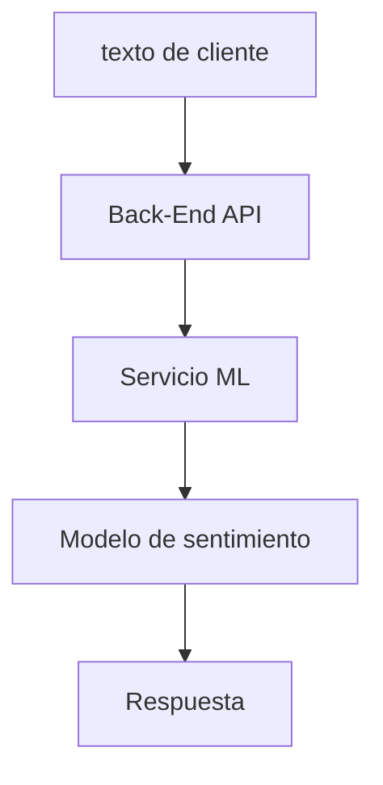

# SentimentAPI - Clasificacion de sentimientos


## Descripcion
**SentimentAPI** es una API REST que permite clasificar el 
sentimiento de texos (comentarios, reseñas o mensajes) 
como **Positivo, Neutro o Negativo**, devolviendo ademas la 
**Probabilidad/Confianza** de la prediccion.

El objetivo del proyecto es demostrar la **integracion entre
Data Science y Back-End**, entregando una MVP funcional capaz de
recibir texto, procesarlo mediante un modelo de Machine Learning
y responder de forma automatica a traves de una API.

---
## Caso de uso
Empresas que reciben grandes volumenes de feedback (reseñas, encuestas,
redes sociales) pueden usar esta API para: 

- identificar rapidamente comentarios negativos
- priorizar respuesta en atencion al cliente
- medir satisfaccion del cliente a lo largo del tiempo
- analizar campañas de marketing

---

## Arquitectura general

- **Backend (Java)**: expone la API publica, valida request, maneja errores
y consume el servicio de ML
- **Data Science (Python)**: entrena el modelo y expone un microservicio
para realizar predicciones

---
## Contrato de la API (Publico)
**Endpoint**
```yaml
POST: /sentiment
```

**Request**
```json
{
  "text" : "El servicio fue excelente"
}
```

**Validaciones**

- Text es obligatorio
- Longitud minima: 3 caracteres
- Longitud maxima: 2000 Caracteres

**Response (200 OK)**

```json
{
  "prevision": "positivo",
  "probabilidad" : "0.87"
}
```
**Posibles valores de Prevision**

- Positivo
- Neutro
- Negativo

---
## Respuestas de error
**Error de validacion (400 Bad Request)**
```json
{
  "error" : "El campo text es obligatorio"
}
```

**JSON mal formado (400 Bad Request)**

```json
{
  "error": "JSON invalido"
}
```

**Servicio ML no disponible (503 Service Unavailable)**

```json
{
  "error": "Servicio de prediccion no disponible"
}
```

---

## Contrato interno (Backend ↔ Data Science)

**Endpoint**
```yaml
POST: /predict/sentiment
```

**Request**
```json
{
  "text" : "El servicio fue excelente"
}
```

**Response**
```json
{
  "prevision" : "Positivo | Neutral | Negativo",
  "probabilidad" : 0.87
}
```
- Prevision: Clase predicha por el modelo
- Probabilidad: Confianza de la clase ganadora (0-1)

---
## Puertos y servicios
| Servicio                  | Puerto |
|---------------------------|--------|
| Backend Java (SpringBoot) | 8000   |
| Servicio ML (Python)      | 8080   |

---

## Como ejecutar el proyecto (Local)

**Backend (Java)**

Requisitos:
- Java 21+
- Maven

Ejemplo de arranque (Terminal):
```bash 

cd backend-java
mvn spring-boot:run
```

La API estara disponible en:
```yaml
http://localhost:8000
```
---

**Data science**

Requisitos:

- Python 3.12.3
- virtualenv
- librerias principales:
  - fastapi
  - uvicorn
  - pydantic
  - joblib
  - numpy
  - scikit-learn
  - imbalanced-learn

Ejemplo de arranque (Terminal):

```bash

cd ml-python
python -m venv venv
source venv/bin/activate
pip install -r ../requirements.txt
uvicorn main:app --host 0.0.0.0 --port 8080
```

---

## Stack tecnologico

**Backend**
- java 21
- Spring boot 4.1
- Bean validation
- REST API

**Data Science**

*Por definir

---

## Estado del proyecto
Backend: 


Data Science 

---

## Equipo

Proyecto desarrollado por estudiantes de Backend 
y Data Science como parte de un Hackathon de **NoCountry** junto
con **AluraLatam**, con enfoque en integración real entre disciplinas y buenas prácticas de desarrollo

**Integrantes**:

⚙️ **Backend Team**

<table>
  <tr>
    <!-- Backend 1 -->
    <td align="center" width="200">
      <a href="https://github.com/TinusLopez">
        
        <br />
        <strong>Florentino Lopez</strong>
      </a>
      <br/>
      <sub>Backend Developer</sub>
    </td>
    <!-- Backend 2 -->
    <td align="center" width="200">
      <a href="https://github.com/lorenaraygoza09">
        
        <br />
        <strong>Lorena Raygoza</strong>
      </a>
      <br />
      <sub>Backend Developer</sub>
    </td>
    <!-- Backend 3 -->
    <td align="center" width="200">
      <a href="https://github.com/Sneyki01">
        
        <br />
        <strong>Edwing Herrera</strong>
      </a>
      <br />
      <sub>Backend Developer</sub>
    </td>
    <!-- Backend 4
    <td align="center" width="200">
      <a href="https://github.com/backend4">
        
        <br />
        <strong>Nombre Apellido</strong>
      </a>
      <br />
      <sub>Backend Developer · Integrations</sub>
    </td>-->
  </tr>
</table>


📊 **Data Science Team**

<table>
  <tr>
    <!-- Data 1 -->
    <td align="center" width="200">
      <a href="https://github.com/dzapatasal">
        
        <br />
        <strong>Diego Zapata</strong>
      </a>
      <br />
      <sub>Data Scientist</sub>
    </td>
    <!-- Data 2 -->
    <td align="center" width="200">
      <a href="https://github.com/Fernando-Falla">
        
        <br />
        <strong>Fernando Falla</strong>
      </a>
      <br />
      <sub>Data Scientist</sub>
    </td>
    <!-- Data 3 -->
    <td align="center" width="200">
      <a href="https://github.com/ADRIAN-GP84">
        
        <br />
        <strong>Adrian Galán</strong>
      </a>
      <br />
      <sub>Data Scientist</sub>
    </td>
    <!-- Data 4 -->
    <td align="center" width="200">
      <a href="https://github.com/Sheila-Amaya">
        
        <br />
        <strong>Sheila Amaya</strong>
      </a>
      <br />
      <sub>Data Scientist</sub>
    </td>
<!-- Data 5 -->
    <td align="center" width="200">
      <a href="https://github.com/Alxs68">
        
        <br />
        <strong>Alexis Oliveros</strong>
      </a>
      <br />
      <sub>Data Scientist</sub>
    </td>
  </tr>
</table>

### ❤️ Gracias
Este proyecto existe porque personas reales dedican tiempo real.

---

## Proximas mejoras (roadmap)

- [x] API REST basica

- [x] Validaciones y manejo de errores

- [ ] Integracion de ML

- [ ] Persistencia

- [ ] Docker


Por definir*

---

## Aprendizajes

- Diseño de contratos claros entre Backend y ML
- Manejo de errores entre microservicios
- Exposicion de modelos ML como servicios REST
- Trabajo colaborativo entre perfiles tecnicos distintos

---

## Limitaciones conocidas

- El modelo depende de la calidad de texto de entrada
- No soporta multiples idiomas (Solo español)
- No se maneja sarcasmo ni ironia
- No hay persistencia de resultados

---
## Nota final

Este README es un documento **vivo** y se ira ampliando conforme el
proyecto evolucione.